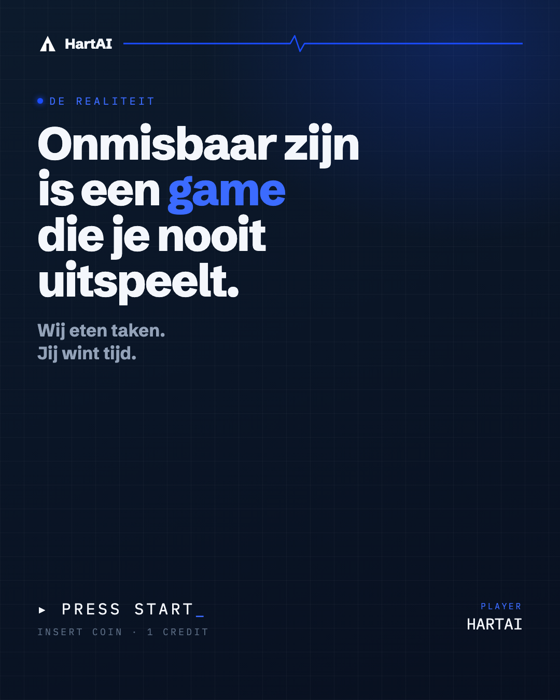
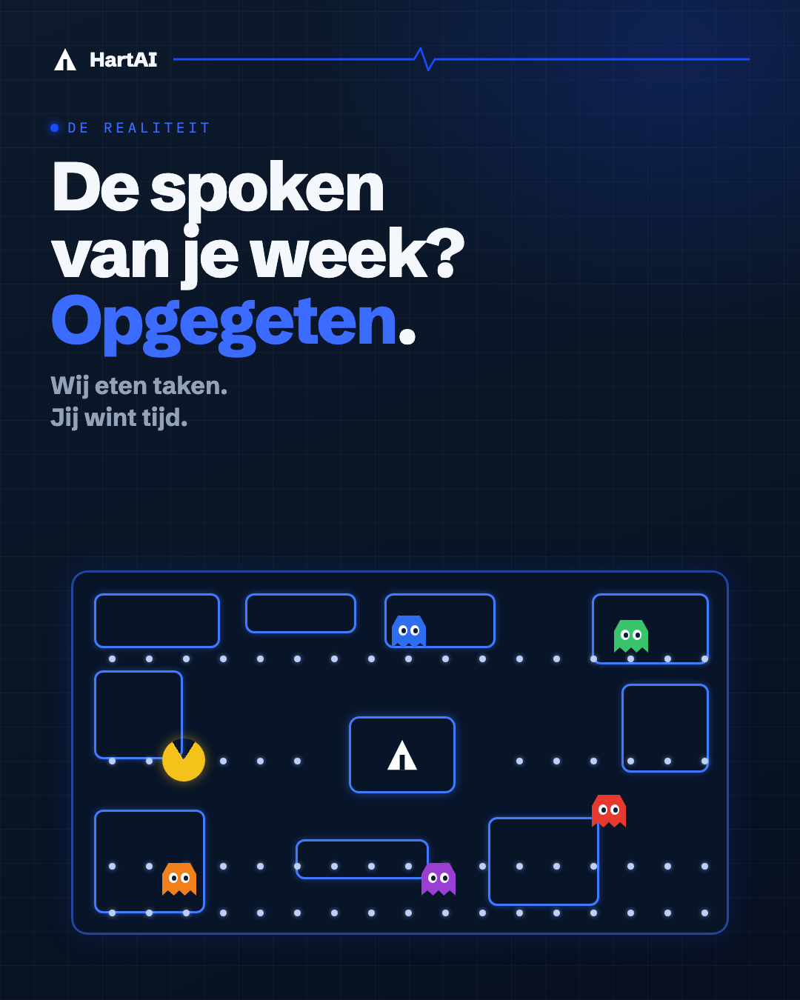
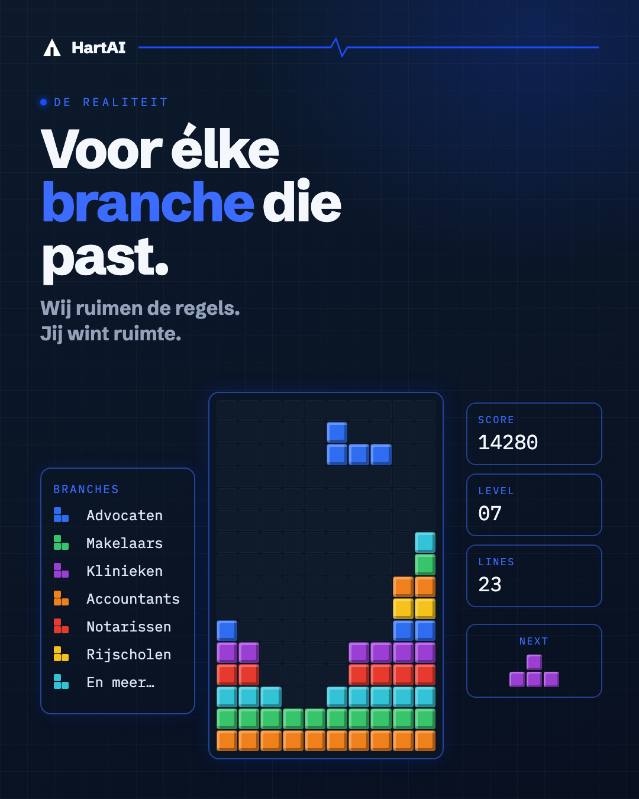
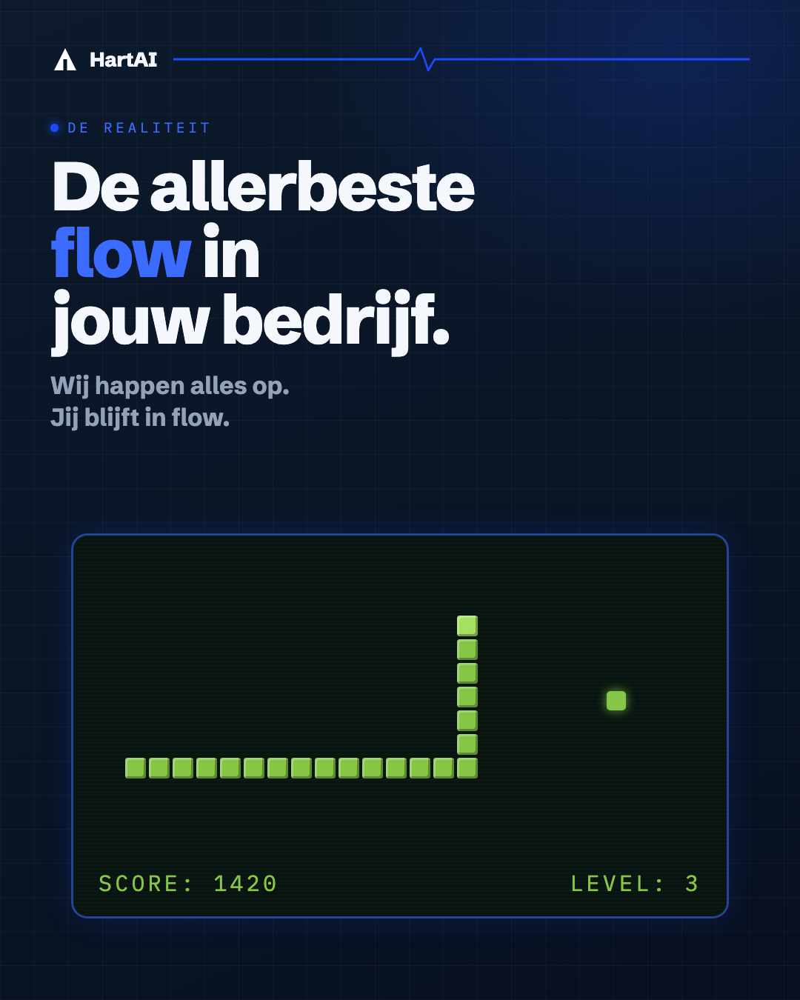
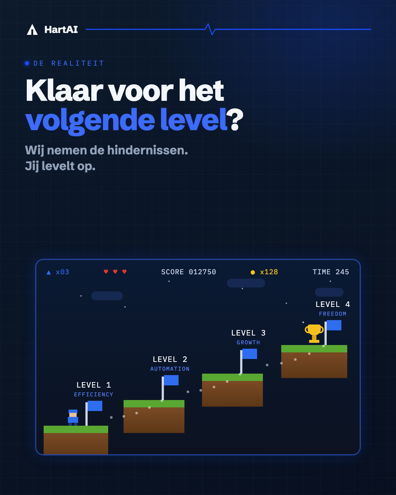
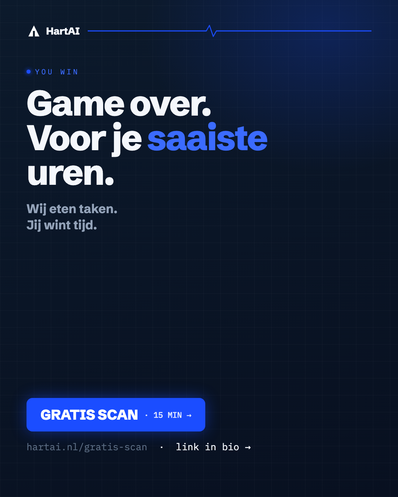

# HartAI — Arcade Reel 🕹️

Retro-arcade Reel: **"je saaiste uren als game."** 6 frames, ~12 seconden.
Concept: elke klassieke game staat voor een stukje HartAI. De tagline beweegt mee met het spel.

---

## 🎬 Montagevolgorde

| # | Frame | Duur | Tagline |
|---|-------|------|---------|
| 0 | Intro | 1,5s | Jouw admin is een game… |
| 1 | Pac-Man | 2,0s | Wij eten taken. Jij wint tijd. |
| 2 | Tetris | 2,0s | Wij ruimen de regels. Jij wint ruimte. |
| 3 | Snake | 2,0s | Wij happen alles op. Jij blijft in flow. |
| 4 | Mario | 2,0s | Wij nemen de hindernissen. Jij levelt op. |
| 5 | Outro | 2,5s | Game over → Gratis scan |

**Pacing:** harde cuts op de beat (geen fades) · **Geluid:** 8-bit / arcade-track (of trending retro-sound) · optioneel "LEVEL UP" / "HIGH SCORE" flash tussen games.

---

## 🖼️ De frames (in volgorde)

### 0 · Intro

### 1 · Pac-Man

### 2 · Tetris

### 3 · Snake

### 4 · Mario

### 5 · Outro

---

## ✍️ Caption (Instagram / Facebook)

> Jouw administratie? Een oud arcadespel dat je nooit uitspeelt. 🕹️
>
> E-mails, facturen, dossiers, verklaringen — level na level blijven ze komen.
>
> HartAI is de speler die nooit verliest. Wij eten de taken. Jij wint de tijd.
>
> → Welke saaie taak mogen wij opeten? Gratis scan (15 min): link in bio 👆
>
> #AI #MKB #automatisering #ondernemen

---

## 📐 Specs
- Alle frames: **1080×1350** (4:5)
- Reel-export: **1080×1920** (9:16) — plaats de frames gecentreerd op de navy achtergrond, of crop naar 9:16
- Huisstijl: navy #0C1A2C→#081020 · accent kobalt #1B4DFF · Schibsted Grotesk + IBM Plex Mono
